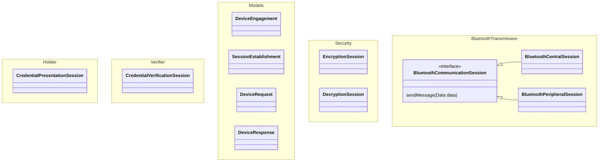

# Mobile | Credential sharing | iOS

A reference implementation for sharing and verifying digital credentials.

The current implementation includes a demo app and implements ISO 18013-5 for in-person Bluetooth presentation and verification.

For internal team members: our ways of working can be found on Confluence.

## Overview

This repository contains packages for: 

- ISOModels: representing data models in CBOR format
- Bluetooth: sharing data over Bluetooth
- SharingSecurity: encryption and decryption of data for transit
- Holder: securely share a credential with a verifier
- Verifier: securely receive and verify a credential from a holder




More details coming soon.

## Requirements

- iOS 16.7
- Xcode 26
- Swift 6

## Setup and installation

1. **Clone the repository**:
   ```bash
   git clone https://github.com/govuk-one-login/mobile-credential-sharing-ios.git
   cd mobile-credential-sharing-ios
   ```

2. **Open in Xcode**:
   ```bash
   open mobile-credential-sharing-ios.xcworkspace
   ```

3. **Configure Team and Bundle Identifier**:
   - Select the project in Xcode
   - Update Team and Bundle Identifier in project settings
   - Ensure proper code signing is configured

4. **Build and Run**:
   - Select your target device
   - Build and run the application

## Usage

### Using the test app

TBC

### Consuming the SDK

#### For presenting

When consuming the SDK for presentation, your `Info.plist` must contain `UIBackgroundModes` for `bluetooth-peripheral`:

```swift
<key>UIBackgroundModes</key>
    <array>
        <string>bluetooth-peripheral</string>
    <array>
```

TBC

#### For verifying

We recommend that you start by reading the GOV.UK Wallet [Technical Documentation](https://docs.wallet.service.gov.uk/consuming-and-verifying-credentials)

When consuming the SDK for presentation, your `Info.plist` must contain `UIBackgroundModes` for `bluetooth-central`:

```swift
<key>UIBackgroundModes</key>
    <array>
        <string>bluetooth-central</string>
    <array>
```

TBC
