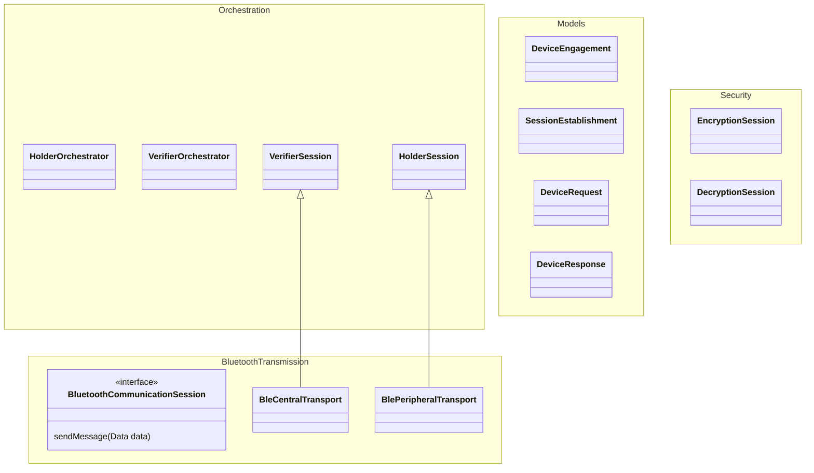

# Mobile | Credential sharing SDK | iOS

This SDK provides an ISO 18013-5 compliant framework for **Holder** (credential sharing) and **Verifier** (credential requesting) roles. Consuming applications adopt the role relevant to their use case (e.g., an identity wallet adopts the Holder role; a relying party app adopts the Verifier role).

The current implementation includes a demo app and implements ISO 18013-5 for in-person Bluetooth presentation and verification.

For internal team members: our ways of working can be found on Confluence.

## Overview

The SDK implements the ISO 18013-5 specification:

- **Device Engagement:** Generates and scans QR codes; broadcasts and connects over BLE/NFC.
- **Session Management:** Establishes secure channels (mdoc session encryption).
- **Message Passing:** Creates, transmits, and parses `DeviceRequests` and `DeviceResponses`.

### Credential Provisioning Flow

The user does not pre-select a credential prior to session initialisation. Verifier attribute requirements are determined after a secure connection is established. Data exchange proceeds as follows:

1. The SDK receives the `DeviceRequest` and queries the Consumer via the `CredentialProvider`.
2. The SDK (or Consumer) presents the consent UI based on the requested attributes.
3. Following consent, the Consumer provides the requested data and cryptographic signatures.

---

This repository contains targets for: 

- Orchestration: Orchestrates the flow & holds the current session and state
- CredentialSharingUI: represents the UI layer connecting to the Orchestrator
- PrerequisiteGate: ensures the device is capable of performing the transaction before cryptography & transport
- CryptoService: representing data models in CBOR format & encryption and decryption of data for transit
- BluetoothTransport: sharing data over Bluetooth
- CameraService: Holds the camera logic for Verifier scanning


```mermaid
classDiagram
namespace Orchestration {
    class HolderOrchestrator
    class VerifierOrchestrator
    class HolderSession
    class VerifierSession
}

namespace Models {
    class DeviceEngagement
    class SessionEstablishment
    class DeviceRequest
    class DeviceResponse
}

namespace Security {
    class EncryptionSession
    class DecryptionSession
}

namespace BluetoothTransmission {
    class BluetoothCommunicationSession{
        <<interface>>
        sendMessage(Data data)
    }
    class BleCentralTransport
    class BlePeripheralTransport
}

VerifierSession <|-- BleCentralTransport
HolderSession <|-- BlePeripheralTransport
```

More details coming soon.

## Requirements

- iOS 16.7
- Xcode 26
- Swift 6

## Setup and installation

1. **Clone the repository**:
   ```bash
   git clone https://github.com/govuk-one-login/mobile-credential-sharing-ios.git
   cd mobile-credential-sharing-ios
   ```

2. **Open in Xcode**:
   ```bash
   open mobile-credential-sharing-ios.xcworkspace
   ```

3. **Configure Team and Bundle Identifier**:
   - Select the project in Xcode
   - Update Team and Bundle Identifier in project settings
   - Ensure proper code signing is configured

4. **Build and Run**:
   - Select your target device
   - Build and run the application

## Usage

### Integration Guide: Holder Role

The **Consumer** adopting the Holder role provisions and stores credentials securely. It acts as the secure vault, supplying both issuer-signed data and device signatures when a Verifier initiates a request.

To maintain cryptographic boundaries, the Consumer provides the decrypted raw CBOR credential data; the SDK handles CBOR parsing and filtering. To prove device possession and bind the credential to the current BLE/NFC session, the SDK constructs a `DeviceAuthentication` payload, which the Consumer then signs using the credential's Secure Enclave private key. Finally, the SDK handles all mdoc session encryption for the transport tunnel.

#### 1. Implement the Credential Provider Protocol

The Consumer implements the `CredentialProvider` to allow the SDK to access credentials. The SDK invokes these methods after establishing a secure connection.

```swift
import CredentialSharingUI

class MyCredentialProvider: CredentialProvider {
    
    /// 1. Query Credentials: The SDK invokes this method when the Verifier requests specific document types.
    /// The Consumer returns credentials from secure storage matching the requested types.
    /// Initially this will always return an array of exactly one element: the decrypted raw CBOR data 
    /// for the user's mDL credential.
    func getCredentials(
        for request: CredentialRequest
    ) async throws -> [Credential] {
        // The Consumer retrieves and decrypts the credential payload from secure storage.
        // Returns the raw CBOR data for the requested document type(s).
        let rawCredential = try await secureStorage.fetchCredential(
            matching: request.documentTypes
        )
        
        return [Credential(
            id: rawCredential.id,
            rawCredential: rawCredential.cborData
        )]
    }
    
    /// 2. Device Authentication (Remote Signing): The SDK constructs a `DeviceAuthentication` CBOR payload.
    /// This payload proves device possession and includes session transcripts to prevent replay attacks.
    /// The Consumer signs this payload using the credential's static device private key (Secure Enclave).
    func sign(
        payload: Data, 
        documentID: String
    ) async throws -> Data {
        // 1. The Consumer signs the `payload` using the Secure Enclave.
        // 2. The Consumer returns the signature to the SDK for transport encryption.
        let privateKey = try await secureStorage.getSecureEnclaveKey(for: documentID)
        let signature = try privateKey.signature(for: payload)
        return signature.rawRepresentation
    }
}
```

**Data Models:**

```swift
struct CredentialRequest {
    let documentTypes: [String]
}

struct Credential {
    let id: String
    let rawCredential: Data  // Raw CBOR-encoded credential data
}
```

#### 2. Initialise the Holder Module

The Consumer initialises the sharing module by injecting the provider.

```swift
let credentialProvider = MyCredentialProvider()
let presenter = CredentialPresenter(
    credentialProvider: credentialProvider,
    logger: logger,
    completion: {}
)
```

#### 3. Start a Sharing Session

The Consumer initiates the engagement QR code display. The SDK awaits the Verifier's request, queries the `CredentialProvider`, and prompts for consent.

```swift
// The SDK displays the Device Engagement UI (QR code) and listens for Verifiers.
let journeyVC = presenter.viewControllerForSharingJourney()
self.present(journeyVC)
```


---

### Integration Guide: Verifier Role

#### [Sample implementations can be found here](docs/sample-implementations.md)

The **Consumer** adopting the Verifier role requests attributes and consumes the verified response. It acts as the trust anchor, supplying the SDK with the Root Certificates of trusted issuers.

To maintain cryptographic boundaries, the SDK handles the complete transaction lifecycle: it manages the camera scanner, establishes the secure BLE tunnel, decrypts the `DeviceResponse`, and cryptographically validates the Issuer's signature and data integrity. The Consumer defines the request and receives the validated data.

#### 1. Initialise the Verifier Module

The Consumer initialises the Verifier module, injecting the Root Certificates used to validate the Issuer's signature on the credential. The SDK utilises an internal `PrerequisiteGate` to resolve transport availability at runtime.

```swift
import CredentialSharingUI

// Provide the Root CAs for the issuing authorities you trust
let trustedRoots = [myGovernmentRootCA, myOtherTrustedCA]

let verifier = CredentialVerifier(
    trustedCertificates: trustedRoots
)
```

#### 2. Request Attributes

The Consumer defines the `CredentialRequest` up front. This specifies the document type, the required attributes and an intent to retain boolean value for each attribute.

```swift
let request = CredentialRequest(
    documentType: "org.iso.18013.5.1.mDL",
    requestedElements: ["family_name": true, "given_name": false, "age_over_18": false]
)
```

#### 3. Start Verification & Process Response

The SDK takes control of the flow: it launches the camera, scans the engagement QR code, establishes the BLE connection, transmits the request, and validates the response. The Consumer awaits the final, cryptographically verified data.

```swift
do {
    // The SDK handles the entire scanning, connection, and validation lifecycle
    let verifiedData = try await verifier.requestDocument(
        request, 
        presentingFrom: currentViewController
    )
    
    // The SDK has already validated the MSO signature and hash integrity. 
    // The Consumer can safely proceed with the verified flow.
    let ageOver18 = verifiedData.getValue(for: "age_over_18")
    let familyName = verifiedData.getValue(for: "family_name")
    
} catch {
    // Handle errors (e.g., user cancelled, invalid signature, connection dropped)
}
```
